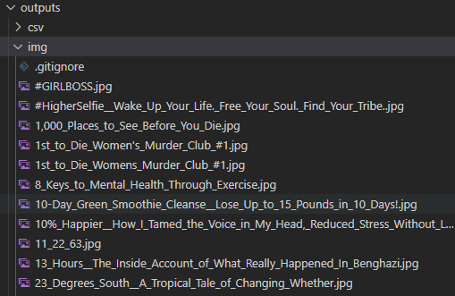

# P2_couignoux_julien

## Books Online

This script checks the site __[Books to Scrape](https://books.toscrape.com/)__ to collect information about books and stocks them by category into csv files.

-----  
>Run the script with the command *python main.py*

>You can get your dated and categorized .csv ouputs in the *outputs/csv* folder

>You can get your renamed image ouputs in the *outputs/img* folder

